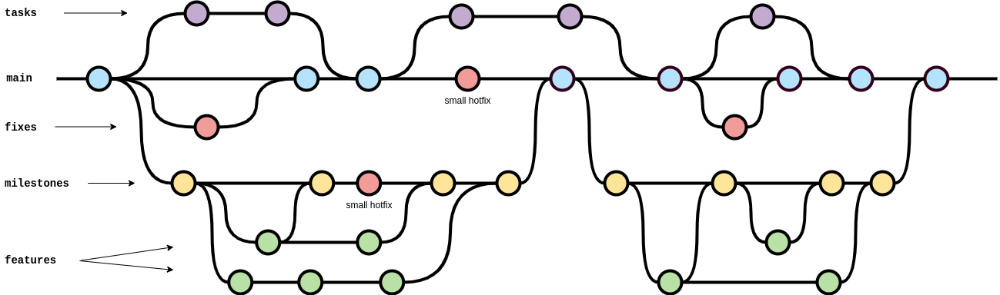

# TEAM

## Team members
- Gründlinger Diana
- Huber Marcel
- Klotz Thomas
- Targa Aaron
- Thalmann Matthias

## Communication and organization
We are using Discord and Telegram to communicate.
We plan to have one fixed weekly meeting and have additional meetings if necessary.

All tasks, features and bugs are tracked with the issue tracker of GitLab. The issues are then assigned to a member, which is going to solve/implement it.

### Task distribution
The weekly meeting is used to identify, group and distribute the tasks among the members.
We have no fixed responsibilities yet.

## Workflow
- The main branch contains all finished milestones, tasks and other documents.
- For each weekly task there will be a separate branch, which will be merged directly to the main upon completion of the corresponding task.
- For each milestone there will be a separate branch, which will be merged directly to the main upon completion of the corresponding milestone.
    - For each feature within the milestone there will be a separate branch, branching off from the milestone branch.
      It will be merged back into the milestone branch upon completion.
- Small hotfixes can be committed directly to the main/corresponding branch, where large ones need their own branch.

### Branch naming conventions
- Task branches: `task-<number>`
- Milestone branches: `milestone-<number>`
    - Feature branches: `feature-<name>`
- Fix branches: `fix-<name>`
